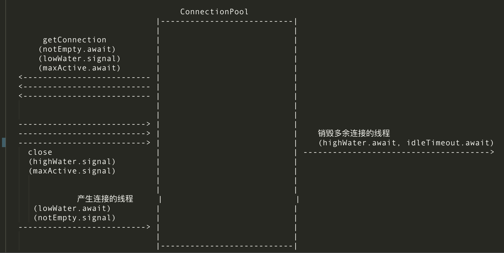

# TinyDruidPool
TinyDruidPool用于学习数据库连接池Druid的项目，所有代码都仿照Druid编写，但TinyDruidPool只保留连接池的初始化、添加、释放、关闭等功能。去除所有其它功能(如：配置文件载入、过滤器管理)

官网文档描述(未成功加载见：doc/druid-pool.png)：


## 功能概述
DruidAbstractDataSource.java

```java
    protected ReentrantLock  lock;
    protected Condition      notEmpty;
    protected Condition      empty;
```
DruidDataSource.java

```java
    private CreateConnectionThread createConnectionThread;
    private DestroyConnectionThread destroyConnectionThread;
    private DestroyTask destroyTask;
    private volatile DruidConnectionHolder[] connections;
```

## 初始化
//略
## 获取连接
//略
## 关闭连接
//略